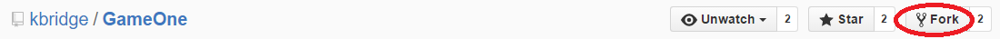
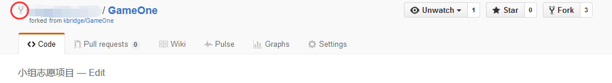
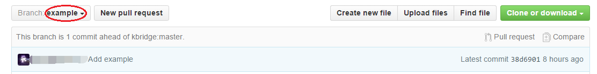
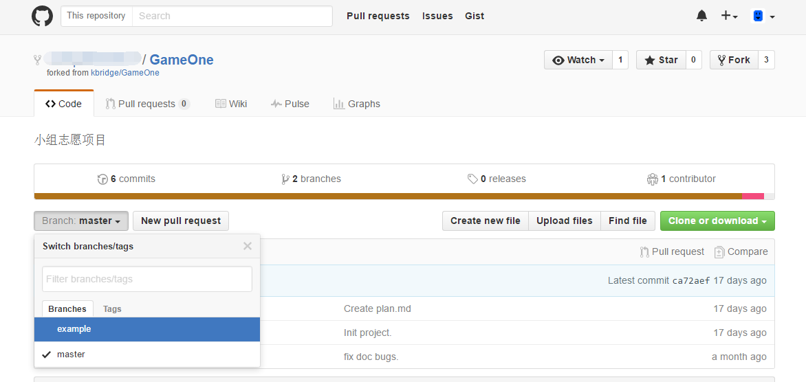
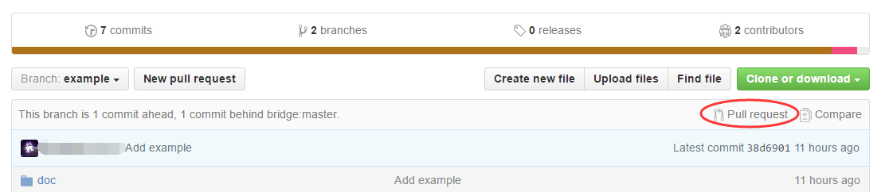
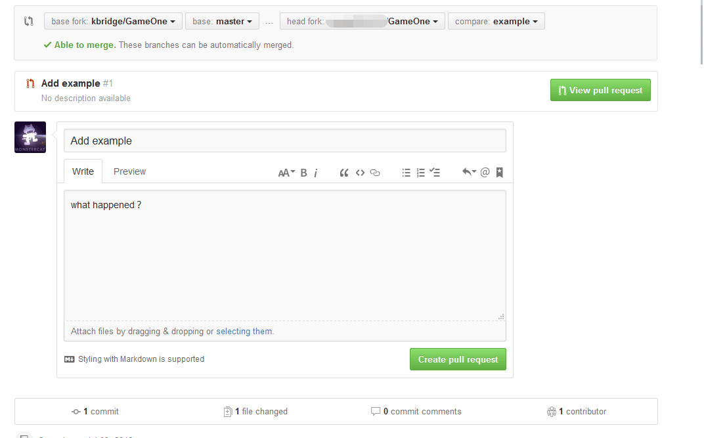
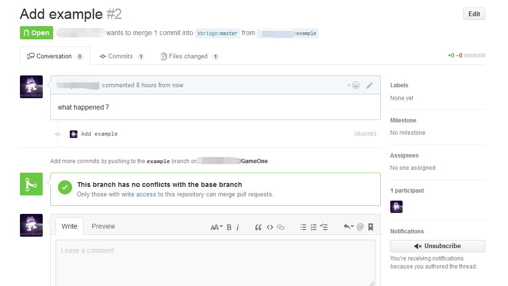
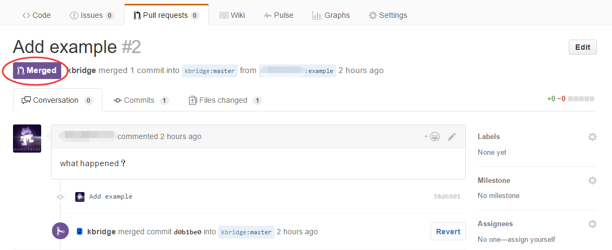

# 使用Git合作

如果你已经接手了任务，或者想在项目中尝试自己的想法，但还不知道怎样做。那么可以参照本文。

## 步骤

### Step1
首先，你需要Fork本项目。点击右上方的Fork按钮。完成后，你的GitHub中会出现一个本项目的复制品。





### Step2

把这个复制品克隆到你的电脑上。你可以用GitHub Desktop，也可以在命令行下使用<code>git clone</code>。

在使用任何<code>git xxx</code>命令之前，确定你已经切换到了项目目录（文件夹）下。下面演示该怎么切换：

```
C:\Users\Hacker>_
C:\Users\Hacker>cd /d E:\GitHub\G
C:\Users\Hacker>cd /d E:\GitHub\GameOne
E:\GitHub\GameOne\>_
```

文件名可以按TAB键补全。

### Step3

先确认项目能在你的电脑上编译运行。

具体做法：打开<code>src/proj.win32/Parkour.sln</code>。点击调试。

### Step4

你现在所在的分支是主分支<code>master</code>。要加入自己的更改，你最好创建一个新分支。做法是在命令行下输入：

```
git checkout -b NAME
```

**NAME**是分支名，给分支起的名字要容易被人看懂。如果你负责实现玩家跳跃的功能，可以起名叫player-jump。

之后输入<code>git branch</code>检查是否已经切换到了这个新分支。你会得到类似这样的结果：

```
* NAME
  master
```

### Step5

打开项目，做出自己的更改。每完成一步更改，都应该向git提交并记录日志。除了一些小功能外，每个功能都需要几步更改才能完成。我建议你每完成一步都进行一次提交，完成一天的任务时，推送最新内容到你的GitHub仓库做备份。

提交更改之前，可以<code>git status</code>查看本次更改的概况，用<code>git diff</code>查看改动了哪些位置。

用下面的命令进行提交：

```
git add -A
git commit -m "日志内容"
```

### Step6

要把自己的改动并入主项目，首先你要把它们推入你的远程仓库，命令如下。你也可以用这种方法进行备份。推送完成后，你可以在你远程仓库的在线页面上查看。

```
git push origin NAME
```



### Step7

在你开发自己的部分时。其他人给主项目做的贡献**并不会**自动同步到你的仓库中。如果你想看一下最新版项目的效果，可以更新主分支。第一次更新时，你要先加入主项目的地址。

```
git remote add latest https://github.com/kbridge/GameOne.git
```

之后用<code>git remote -v</code>检查是否加入成功。效果如下：

```
latest  https://github.com/kbridge/GameOne.git (fetch)
latest  https://github.com/kbridge/GameOne.git (push)
origin  https://github.com/YOU/GameOne.git (fetch)
origin  https://github.com/YOU/GameOne.git (push)
```

需要把主分支刷到最新版时，输入下面的命令：

```
git checkout master
git fetch latest
git merge latest/master
```

上面的第一条命令会把你切换到主分支。在主分支中，你会发现项目中你的更改已经消失不见。要继续开发，用下面的命令**切回你的分支**：

```
git checkout NAME
```

使用<code>git branch</code>来检验：

```
* NAME
  master
```

### Step8

你完成了你的部分，想把你的更改并入主项目。为此，首先确认你已经把最新的更改推入了远程仓库（可以总是先在此时在你的分支下执行<code>git push</code>）。然后，在你远程仓库**你的分支上**，发起一个Pull Request，并写下你最终实现了什么。Pull Request会发送给主项目管理人，他收到后，会选择是否拉入你的分支，合并到主项目。

选择分支：



发起Pull Request：



写下你最终实现了什么：



Pull Request创建成功：



### Step9

管理人并入你的更改后，你会收到通知。此时最好参照上面的[Step7](#Step7)，把最新版的主项目刷到你的主分支上，并观察编译运行的效果。再接手新的任务时，确认是在主分支上（可以总是在此时执行<code>git checkout master</code>），然后从第4步反复。你之前的分支已经没用，可以用<code>git branch -D NAME</code>来删除。

Pull Request被接受：



