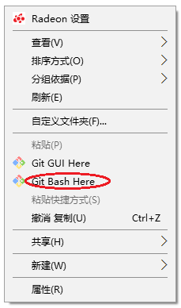
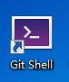
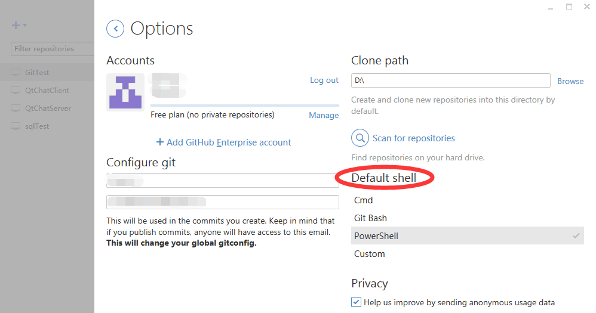
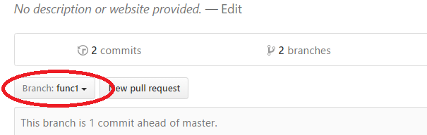
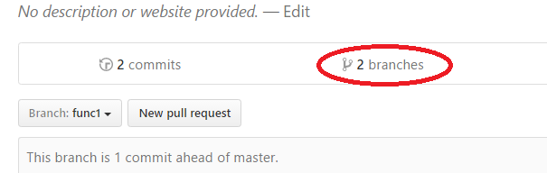
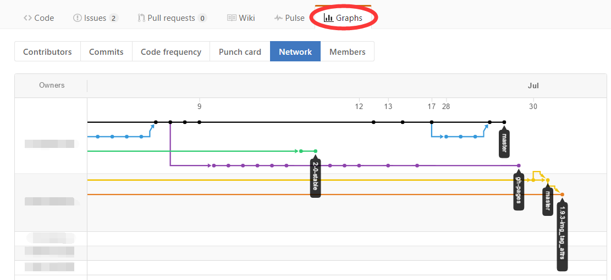
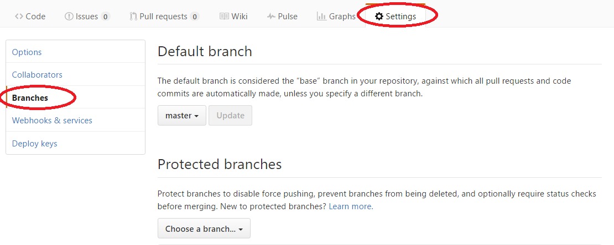

# Git 常见用法

## 介绍

### 1.Git是什么？

维基百科：
> Git是一个**分布式版本控制**软件。

有道词典：
> git n. 饭桶

### 2.什么是版本控制？

管理文件的更改。

### 3.怎么实现？

记录历史。

拿出你家的相册，抽出你5岁时的照片、7岁时的照片、12岁时的照片…拿相邻的两张去对比，14岁版本的你和15岁版本的你不同，你长高了，或者青春痘的数量变了？你已经在做版本控制了。

### 4.可是这有什么用？

合作。

对于小型项目而言，不仅没用，可能还是累赘。如果有人每天花太多时间观察自己代码的历史，那他肯定有一点自恋的倾向。

但如果项目的规模变大，或人手增多，版本控制的价值就会凸显。一个文件里的源代码，随着项目开展会越来越多，它们是一点点变多的——上个月，Bob增加了背景引擎，上星期，Alice让玩家能够跳跃，未来一星期，小组打算修复一个计分的bug，这个任务分配给了David。这些活动都给player.cpp造成了更改。版本控制系统会把谁在何时做了什么更改记录下来，如果有段代码特难懂，或者造成了程序崩溃，可以很容易找到责任人。

版本控制系统能帮你合并更改，比如Bob修改了某文件中的func1()，而Alice在同一时间修改了其中的func2()，他们提交后，这个文件会包含二人的更改。版本控制系统把他们的工作成果合并了。

还有一个用途：备份。文件被改得面目全非？或者意外删除？把上一个版本_签出_即可。

### 5.我该从哪里开始？

选一款软件。

下面是Git的教程。企业一般用SVN（SVN与Git类似，也很不错），不过学习Git能让你快速入手GitHub，你能接触到很多开源软件，而且马上就拥有完全自己控制的代码库，于是你得到了全貌。在企业你很难如此。

学习[**基础知识**](http://www.ruanyifeng.com/blog/2008/12/a_visual_guide_to_version_control.html)。

## 命令行

本文介绍的是命令行下Git的用法。用命令行版本可让你更近距离地了解Git，如果你青睐图形界面，可以尝试GitHub Desktop或TortoiseGit.

[Git for Windows](https://git-for-windows.github.io/)的用户可以右键文件夹窗口，打开Git命令行：



GitHub Desktop的用户可以使用Git Shell：



推荐的命令行是Git Bash。这不是GitHub Desktop的默认命令行，你可以在它的选项里调整：



Git Bash常见命令：

```
ls              # 列出当前文件夹（也叫目录）的文件
pwd             # 打印当前目录
cd xxx          # 切换目录到xxx
cd ..           # 切换到上级目录
cd /e           # 进入E盘根目录
mkdir xxx       # 创建目录xxx
touch a         # 创建空文件a
mv a b          # 修改文件a的名字为b
mv a /e/project # 把文件a移动到E盘project目录下
rm a            # 删除文件a
rm -r xxx       # 删除目录xxx
```

命令执行时，你可以随时用<code>Ctrl+C</code>中断其运行。

你可以用命令<code>exit</code>或者快捷键<code>Ctrl+D</code>退出Git Bash命令行。

## 配置

在第一次使用git之前，执行下面的命令：

```
git config --global user.name '你的名字'
git config --global user.email '你的E-mail'
git config --global alias.co checkout
```

其中最后一条命令的作用是设置*别名*。以后所有用到<code>git checkout</code>的地方都能用<code>git co</code>代替（但本文后面用的还是checkout）。观察它那形式，你肯定知道该怎么创建其他别名了。

## 工作流

个人使用Git的流程如下：

### 1.初始化版本库

```
git init
```

这条命令执行之后，当前文件夹就变成了一个Git版本库。

__注__：你还能用<code>git clone</code>命令创建一个版本库。参见后面“远程仓库/克隆"。

### 2.做出更改

“更改”包括：

- 创建、删除、移动（重命名）文件
- 修改文件内容

### 3.查看更改状态

列出发生变更的文件：

```
git status
```

用less查看对已有文件的改动：

```
git diff
```

__注__：对超过1屏的内容，less自动分屏显示。使用方向键/Home/End/PgUp/PgDn浏览。按<code>q</code>可以退出less。

### 4.提交到版本库

提交到版本库，就是要Git记录这次的更改。除了要指定哪些文件中的更改需要记录外，还要写一条message描述这次更改。对很多不很聪明的人（比如我）来说，写程序本身就几乎绞尽脑汁，编message简直是神补刀。但message是必须的！一是Git强制你写，二是它能方便别人理解你这次的工作。

庆幸的是，多数情况下message只需要一句话，比如“添加了跳跃功能。”如果用英文写，别用过去式（Fixed a bug.）或者第三人称（Fixes a bug.），用祈使句（Fix a bug.）。message的详细写法参见[这里](http://tbaggery.com/2008/04/19/a-note-about-git-commit-messages.html)。

提交所有改动：
```
git add -A
git commit -m "MESSAGE"
```

**注**：如果你只输入了<code>git commit</code>，后面没跟参数，系统会自动打开vim编辑器供你编辑message。vim的简单用法：

- 默认在正常模式
- 按<code>i</code>进入编辑模式
- 按<code>Esc</code>从编辑模式退出
- 在正常模式下输入<code>:wq</code>实现保存并退出
- 在正常模式下输入<code>:q!</code>强制退出（不保存）

只提交file1和file2的改动：

```
git add file1 file2
git commit -m "MESSAGE"
```

只提交对已有文件的更改，忽略新文件：

```
git commit -am "MESSAGE"
```

写下多段说明：

```
git add ...
git commit -m "MESSAGE_0" -m "MESSAGE_1" -m "MESSAGE_2"
```

查看已有的提交：

```
git log
```

__注__：已有提交记录超过1屏时，系统自动打开less分屏显示。按<code>q</code>可以退出less。

单行打印已有提交：

```
git log --oneline
```

__注__：诸如<code>059a8a1b4cc14afef7b7bcb13dceb000250762d7</code>这样的字串是SHA-1校验值，Git用它来唯一标识一次提交。简短表示时，只取前7个字符，比如这里是<code>059a8a1</code>。

### 5.撤销文件更改

撤销对file的改动：

```
git checkout -- file
```

撤销（当前文件夹下的）所有改动：

```
git checkout -- .
```

__注__：使用checkout命令时必须小心！稍不注意辛苦写成的代码就会被抹掉。

### 6.重复

重复2-5.

## 远程仓库

远程仓库是你仓库的备份，它在世界的另一个角落。远程仓库通常由GitHub这样的网站提供，GitHub上建立的仓库都是公开的，任何人都能看到，不想这样你就要掏美金。要是隐私对你很重要，可以试试BitBucket，它提供免费的私有仓库。但它在国内访问不稳定，我们国家防火墙太厚。

Git提供了一对命令来实现与远程仓库交互：push，用来把本地（相对与“远程”而言）的更改更新到远程；pull，用来把远程的变化同步到本地。

如果参与开发的只有你一人（通常如此，孤独的程序员啊），一般本地仓库会比远程仓库超前。这时进行push就会把自从上次以来，远程仓库落下的更改发送到远程仓库。

如果你使用GitHub的在线编辑器提交了改动，本地分支就会落后。你需要执行pull把新的改动接收到本地。还有更复杂的情况：在远程的改动_还没有_刷到本地时，本地出现了新的改动。这时你push会失败，它会被拒收。你必须先pull。pull在接收远程改动之后，会执行一次_合并_，之后再push就没问题了。

### 克隆

你可以通过_克隆_，在你电脑上创建远程仓库的一个复制品（这是另外一种建仓库的方法）。创建好后，远程仓库的地址会被加入，它会成为你push/pull的默认目标。

```
git clone http://github.com/USER/REPO.git
```

### 管理

列出所有远程仓库：

```
git remote -v
```

添加远程仓库，起名叫origin：

```
git remote add origin http://github.com/USER/REPO.git
```

**记住**：给默认的远程仓库起名叫origin就对了。

### 推送

把本地更改更新到远程仓库：

```
git push
```

如果这是你添加远程仓库后第一次push：

```
git push -u origin master
```

### 取回

把远程仓库的变化同步到本地：

```
git pull
```

**注**：如果本地和远程各有各的更改（如上面所述），pull_合并_远程到本地会产生一次新的提交，这时会弹出vim编辑器要你输入这次提交的message。你可以输入<code>:wq</code>，保留默认message，完成。

仅仅取回，不同步：

```
git fetch
```

与取回的远程分支master同步：

```
git merge origin/master
```

## 分支

如果你不干涉，版本库里就只有一条代码线，你每次提交会创建一个新节点，延伸它。代码线的学名叫*分支*。默认的分支叫主分支，内部名称<code>master</code>。

Git允许你创建新分支。也就是从某次提交开始，完全独立发展的代码线，你在上面的提交，不会影响到其他分支的发展，只会延伸这条线。其他版本控制系统也提供分支功能，但Git分支操作的速度比他们都要快，使用十分方便，形成了独特的使用方式。（参见下面的“分支工作流”）

比如，你的软件面临更新。你要增加一个新功能，还要修复一个bug：

- 你可以开两个*分支*：<code>function-x</code>和<code>bugNNN</code>，分别用于新功能的开发和bug修复
- 你在一个分支上提交修改，其他分支都不会有影响。（所以单项工作的进行过程会很清晰。而一项工作中的问题，不会渗透进其他工作。）
- 完成分支的工作后，你可以*合并*它们到主分支。
- 合并后，主分支会多出一次提交，在这次提交上，主分支与所有参与合并的分支同步。
- 合并后，分支还可以继续独立发展，但通常你会想*删除*它们。
- 有的分支发展到一半就停下，你发现搞砸了，这时你也可以删掉他们。
- 你可在分支上再开分支，但很少需要这样。

多人开发时，如果共享一个分支，那么每人每次提交之前都不得不合并其他人的工作，版本库会堆积大量无用的合并提交，每个人的贡献也变得混乱。所以这时也会给每个人建立一个分支。

合并时，假如两个分支都对某个文件做了更改：

- 一个分支修改了行A，一个分支修改了行B：合并后的文件里，两处更改都会出现。
- 两分支对同一行做了不同的修改：发生*冲突*，你需要手工解决。

### 分支工作流

#### 1.开辟新分支

开辟一个新分支BRANCH，并切换到这个分支：

```
git checkout -b BRANCH
```

**注**：习惯用横线分割的英文词组作分支名。比如：<code>jumping</code>和<code>player-jump</code>。

#### 2.在分支上工作

对于一般的工作，上面“工作流”介绍的命令仍可用。

查看当前分支：

```
git branch
```

切换回主分支：

```
git checkout master
```

把OLD\_BRANCH改名为NEW\_BRANCH：

```
git branch -m OLD_BRANCH NEW_BRANCH
```

#### 3.合并到主分支

合并BRANCH1和BRANCH2的提交到主分支：

```
git checkout master
git merge BRANCH1 BRANCH2
```

#### 4.删除分支

删除之前，先切换到主分支：

```
git checkout master
```

删除BRANCH分支：

```
git branch -d BRANCH
```

如果BRANCH最新的提交没有合并：

```
git branch -D BRANCH
```

### 分支与远程仓库

#### 推送分支

推送本地分支BRANCH1到默认远程仓库（首次）：

```
git push -u origin BRANCH1
```

之后在此分支使用无参数的push即可。

#### 拉取分支

首次拉取远程分支BRANCH1时：

```
git fetch
git checkout BRANCH1
```

之后在此分支使用无参数的pull即可。

**注**：当你克隆远程仓库时，所有分支的数据都会被下载。但主分支以外的分支不会显示。要显示包括它们在内的所有分支，用下面的命令。使用<code>git checkout</code>时，给出的分支名若与远程分支一致，对应的远程分支就会取消隐藏。

```
git branch -a
```

#### GitHub中的分支

##### 切换分支

在这个按钮处可以切换当前浏览的分支：



##### 管理分支

点branches链接，进入分支管理页面。可以在这里删除分支：



在这里可以查看项目分支的发展：



在这里可以修改默认分支和分支保护状态：

如果创建了organization，就能在这里限制本组织内谁能向某分支推送。



## 复杂情况

### 使用.gitignore文件

可以在.gitignore文件中指定哪些文件不提交到版本库。它的内容是文件名列表。.gitignore所在目录及其子目录中的文件和文件夹，如果与.gitignore文件中的文件名匹配，就不会在<code>git add</code>时计入。即使加-A参数也一样。

比如，编译程序产生的OBJ和EXE文件不需要提交到版本库。可以在.gitignore中加入<code>\*.obj</code>和<code>\*.exe</code>忽略它们。

常见开发环境（如VS）的.gitignore文件：[下载](https://github.com/github/gitignore)

### 中止跟踪文件

```
git update-index --assume-unchanged file
```

之后，Git不会再跟踪file的变化。

## FAQ

### 上一次提交时写错message，怎么修改

```
git commit --amend -m "NEW MESSAGE"
```

### 修改上次提交的内容

```
git reset HEAD~
...修改...
git add 有改动的文件
git commit -c ORIG_HEAD
```

参考[这里](http://stackoverflow.com/questions/927358/how-to-undo-last-commits-in-git)。

**注**：如果你已经把错误的内容推送到了远程仓库，那么这次要强制推送才能覆盖：

```
git push -f
```

### The current branch XXX has no upstream branch.

在执行<code>git push</code>时，出现错误：

```
fatal: The current branch XXX has no upstream branch.
To push the current branch and set the remote as upstream, use

    git push --set-upstream origin master
```

解决方法：

```
git push -u origin master
```

### 签出某次提交时的文件

```
$ git log --oneline
...
ce428ce Refactor.
45d5a34 Add score addition rising up animation.
144f0f3 Add grid drawing and score showing facility.
b7722e3 Add game over checking.
...
$ git checkout b7722e3 -- file
```

恢复：

```
git checkout HEAD -- file
```

### 签出其他分支提交上的文件

签出BRANCH1最新提交的文件file：

```
git checkout BRANCH1 -- file
```

## 参考

- [版本控制入门插图教程](http://www.ruanyifeng.com/blog/2008/12/a_visual_guide_to_version_control.html)
- [Pro Git中文版](https://git-scm.com/book/zh/v2)
- [A Note About Git Commit Messages](http://tbaggery.com/2008/04/19/a-note-about-git-commit-messages.html)
- [How to undo last commit(s) in Git? - Stack Overflow](http://stackoverflow.com/questions/927358/how-to-undo-last-commits-in-git)
- [GitHub Help](https://help.github.com/)
