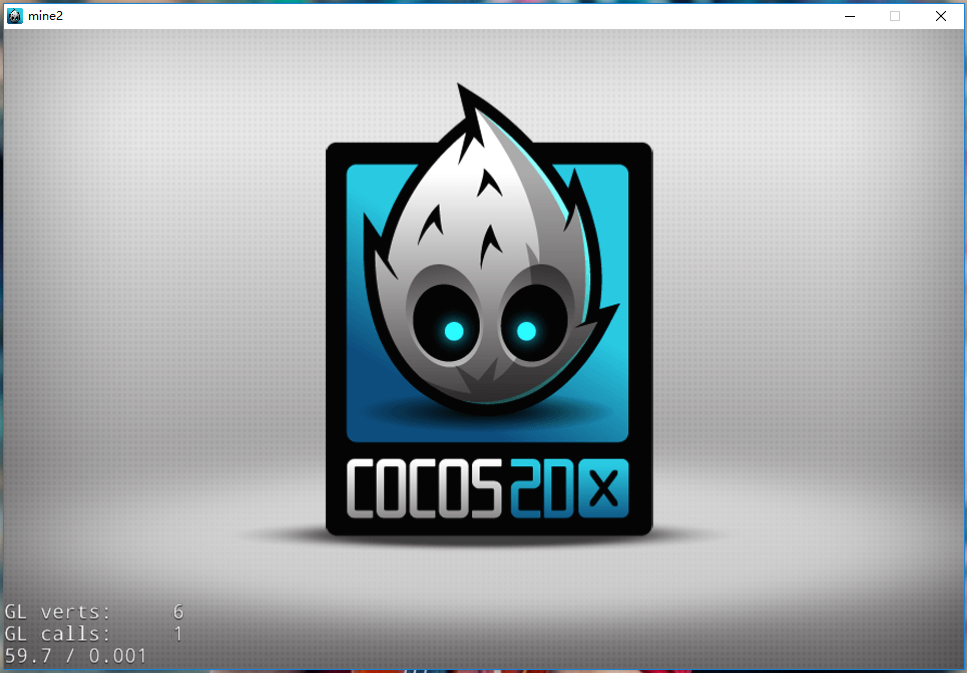

# 安装cocos2d-x

## 准备

### Visual Studio

需要已经安装好2013或2015版的VS。

[VS2015下载](https://www.microsoft.com/zh-CN/download/details.aspx?id=48146)

### Python

安装Python 2.7。安装时记住启用<code>Add python.exe to system PATH</code>这一项。

安装好后，打开新的命令行窗口，输入：

```
python --version
```

如果能得到类似下面的结果，说明安装成功：

```
Python 2.7.x
```

Python下载：

- [下载页](https://www.python.org/downloads/release/python-2711/)
- 一般下载<code>Windows x86-64 MSI installer</code>，32位用户下载<code>Windows x86 MSI installer</code>

### cocos2d-x

下载cocos2d-x 3.11，下载后解压其中的<code>cocos2d-x-3.11</code>文件夹，到一个简单的路径，比如<code>E:\\</code>.

[下载页](http://cocos2d-x.org/download)

## 安装

### 安装命令行工具

打开命令行窗口，按<code>Ctrl+空格</code>关闭中文输入法（如果有的话）。

输入下面的命令，切换至cocos2d的解压目录（假设你解压到了E盘根目录）：

```
cd /d E:\cocos2d-x-3.11
```

输入以下命令，安装命令行工具：

```
python setup.py
```

中间会提示你输入一些第三方工具包的路径，我们用不到它们，所以敲回车跳过即可。

安装结束后，打开新的命令行窗口，输入：

```
cocos
```

如果出现类似下面的结果，说明安装成功。

```
E:\cocos2d-x-3.11\tools\cocos2d-console\bin\/cocos.py 2.1 - cocos console: cocos2d-x 的命令行工具集。

可用的命令：
        run              在设备或者模拟器上编译，部署和运行工程。
        gen-libs         生成引擎的预编译库。生成的库文件会保存在引擎根目录的 'prebuilt' 文件夹。
        luacompile       对 lua 文件进行加密和编译为字节码的处理。
        gui              shows the GUI
        deploy           编译并在设备或模拟器上部署工程。
        package          管理 cocos 中的 package。
        compile          编译并打包工程。
        framework        管理工程使用的 frameworks。
        gen-simulator    生成 Cocos 模拟器。
        new              创建一个新的工程。
        jscompile        对 js 文件进行加密和压缩处理。
        gen-templates    生成用于 Cocos Framework 环境的模板。

可用的参数：
        -h, --help                      显示帮助信息。
        -v, --version                   显示命令行工具的版本号。
        --ol ['en', 'zh', 'zh_tr']      指定输出信息的语言。

示例：
        cocos new --help
```

### 生成模板

在命令行下输入：

```
cocos gen-libs
```

对cocos2d库进行预编译，这个过程会持续20min左右。

**注意**：如果你像我一样，此前卸载过VS，请参考[这里](http://stackoverflow.com/questions/8497931/msbuild-does-not-contain-a-value-for-the-vctargetspath-property)修复编译器问题。否则，最后可能会因一个叫simulator的工程构建失败而告终。

然后输入：

```
cocos gen-templates
```

生成模板。

你可以在cocos的目录下<code>prebuilt</code>目录和<code>templates</code>目录中找到刚刚生成的内容。

## 验证

### 首次运行

在命令行下，切换到某盘根目录，如：

```
cd /d E:\
```

然后创建你的cocos2d工程（把aaa换成你的工程名）：

```
cocos new -l cpp -t binary aaa
```

进入工程文件夹，运行本工程：

```
cd aaa
cocos run -p win32
```

你会看到下面的结果，说明你成功了：



### 增加功能

输入下面命令，打开所在文件夹：

```
explorer .
```

用“画图”（按<code>Win+R</code>输入<code>mspaint</code>来启动）等工具画一张小图片，比如笑脸，保存到<code>Resource\res</code>目录下。

进入<code>proj.win32</code>目录，打开解决方案（.sln）文件。

打开<code>HelloWorldScene.cpp</code>，在函数<code>HelloWorld::init()</code>最后一句return的前面，输入（把其中的<code>face.png</code>替换成你的图片文件名：

```c
	auto face = Sprite::create("face.png");
	auto moveAction = EaseBackOut::create(MoveBy::create(1.0f, Vec2(480.0f, 0.0f)));

	face->setPosition(240.f, 480.0f);
	face->runAction(moveAction);

	addChild(face);
```

按F5运行程序，你看到了什么？

解释：

- auto是C++ 11中新增的功能，意思是：这个变量的类型我懒得写，编译器你帮我自动推断吧。
- 参考：cocos2d中的[actions](http://cocos2d-x.org/docs/programmers-guide/4/index.html).

## 练习

1.把“增加功能”那部分的结果截图发我。你的图片背景是白色的对吗。怎么把它变成透明的？

2.你发现程序build的速度很慢，实际上它每次运行时都会拷贝50个文件进我们的文件夹，但这个过程实际上只要（在工程创建后）运行一次就可以了。怎么解决？（这是官网程序的问题，是的，官网程序也会出问题）

我的建议：废弃官网的程序，我们用CMake来进行构建。

参考：

- cocos目录下的<code>templates\cpp-template-binary\proj.win32</code>目录，这是项目模板。
- 在VS中观察项目的属性，留意：
  - 包含文件目录（Include Directory）
  - 库文件目录（Library Directory）
- 在VS中打开：视图→属性管理器，观察cocos2d\_headers等属性表
- 使用记事本或更高级的编辑器，查看以下文件内容：
  - <code>.vcproj</code>文件
  - <code>.prop</code>文件

修改.vcproj文件中的<code>xcopy</code>命令的一种快速解决问题的方案。
